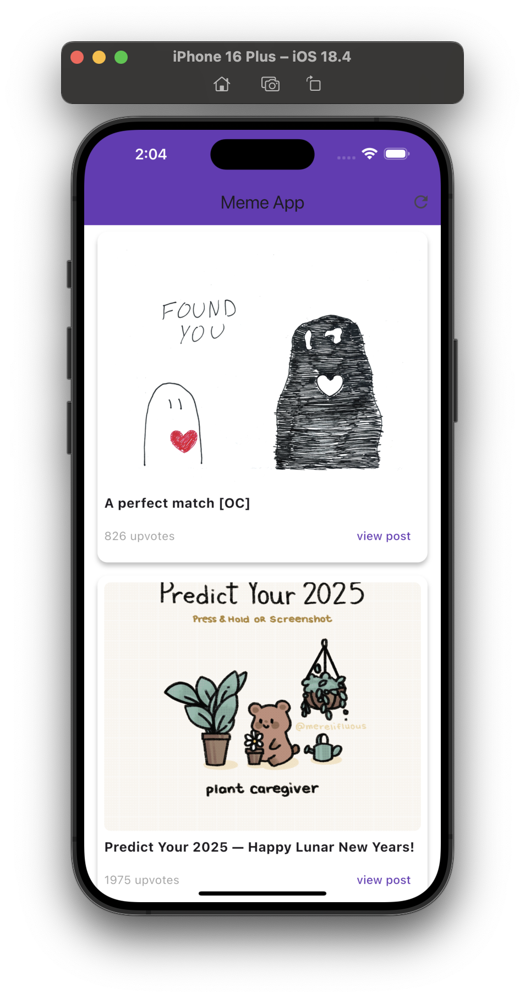
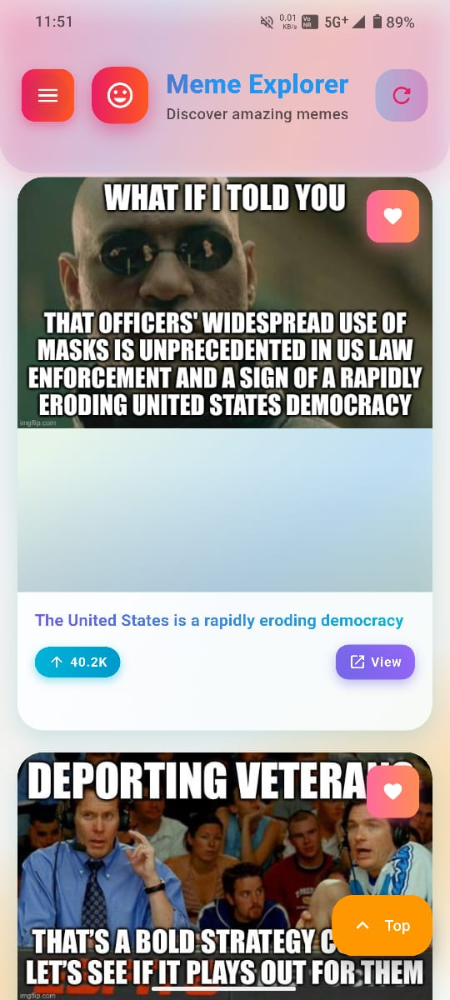
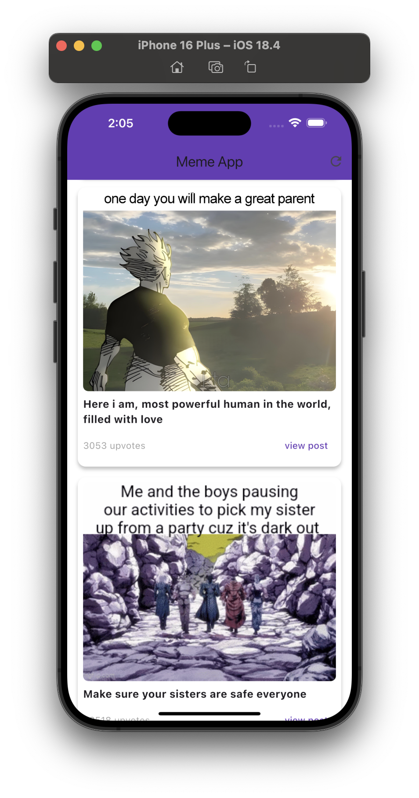

# MemeVerse - Cross-Platform Meme Aggregator

<div align="center">


**A modern, responsive meme aggregation app built with Flutter**  
*Aggregating trending memes from multiple Reddit subreddits into a seamless cross-platform experience*

[Live Demo](https://shourya13x.github.io/MemeVerse/) • [Download APK](https://github.com/shourya13x/MemeVerse/releases)

</div>

---

## 🎯 Project Overview

MemeVerse is a production-ready Flutter application that demonstrates modern mobile development practices, API integration, and responsive design. The app aggregates memes from 7 popular Reddit subreddits, providing users with an infinite scroll experience across web, Android, and iOS platforms.

### Key Technical Achievements
- **Cross-Platform Development**: Single codebase for Web, Android, and iOS
- **REST API Integration**: OAuth2 authentication with Reddit API
- **Performance Optimization**: Infinite scrolling with pagination
- **Modern UI/UX**: Material Design 3 with custom theming
- **Error Handling**: Robust error management and user feedback
- **Responsive Design**: Adaptive layouts for all screen sizes

---

## 📱 Screenshots

<div align="center">

| iOS Interface | Android Interface | Web Interface |
|---------------|------------------|---------------|
|  |  |  |

</div>

---

## 🏗️ Architecture & Technical Stack

### Core Technologies
- **Framework**: Flutter 3.7+ with Dart
- **API**: Reddit OAuth2 REST API
- **State Management**: Flutter's built-in state management
- **UI Framework**: Material Design 3
- **HTTP Client**: `http` package for API calls
- **Image Handling**: `cached_network_image` for optimized image loading
- **Color Analysis**: `palette_generator` for dynamic theming

### Project Structure
```
lib/
├── main.dart              # App entry point & theme configuration
├── models/
│   └── meme_model.dart    # Data models with JSON serialization
├── services/
│   └── meme_service.dart  # API service layer with OAuth2 auth
├── screens/
│   └── meme_home_page.dart # Main UI with infinite scroll
└── widgets/
    └── meme_card.dart     # Reusable UI components
```

### API Integration Details
- **OAuth2 Authentication**: Secure token management with automatic refresh
- **Multi-Subreddit Support**: Random selection from 7 meme subreddits
- **Pagination**: Efficient data loading with cursor-based pagination
- **Error Resilience**: Graceful handling of API failures and network issues

---

## 🚀 Features & Implementation

### Core Features
- **Infinite Scroll**: Seamless content loading with pagination
- **Cross-Platform**: Native performance on Web, Android, and iOS
- **Real-time Content**: Live meme aggregation from Reddit
- **Responsive Design**: Adaptive layouts for all device sizes
- **Modern UI**: Material Design 3 with custom color schemes
- **Error Handling**: User-friendly error messages and retry mechanisms

### Technical Implementation Highlights

#### OAuth2 Authentication Flow
```dart
// Secure token management with automatic refresh
static Future<void> _authenticate() async {
  if (_accessToken != null && DateTime.now().isBefore(_tokenExpiry!)) {
    return; // Token still valid
  }
  // Implement OAuth2 client credentials flow
}
```

#### Infinite Scroll with Pagination
```dart
// Efficient data loading with cursor-based pagination
Future<List<Meme>?> fetchMemes(BuildContext context, {
  int page = 1,
  String? after,
}) async {
  // Implement pagination logic
}
```

#### Responsive Design
```dart
// Adaptive layouts for different screen sizes
Widget build(BuildContext context) {
  return LayoutBuilder(
    builder: (context, constraints) {
      // Responsive grid layout
    },
  );
}
```

---

## 🛠️ Development Setup

### Prerequisites
- Flutter SDK 3.7+
- Dart SDK 3.0+
- Android Studio / VS Code
- Git

### Installation
```bash
# Clone the repository
git clone https://github.com/shourya13x/MemeVerse.git
cd MemeVerse

# Install dependencies
flutter pub get

# Run the application
flutter run
```

### Build Instructions
```bash
# Web build
flutter build web

# Android build
flutter build apk

# iOS build (requires macOS)
flutter build ios
```

---

## 🔧 Technical Skills Demonstrated

### Mobile Development
- **Flutter Framework**: Cross-platform development with single codebase
- **Dart Programming**: Modern, type-safe language with async/await patterns
- **Material Design**: Implementation of Material Design 3 guidelines
- **State Management**: Efficient state handling for complex UI interactions

### API Integration & Backend
- **REST API Design**: Clean service layer architecture
- **OAuth2 Authentication**: Secure API authentication implementation
- **Error Handling**: Comprehensive error management and user feedback
- **Data Serialization**: JSON parsing and model management

### Software Engineering
- **Code Organization**: Clean architecture with separation of concerns
- **Performance Optimization**: Efficient data loading and caching
- **Responsive Design**: Adaptive layouts for multiple screen sizes
- **Version Control**: Git workflow and project management

### DevOps & Deployment
- **CI/CD**: Automated build and deployment processes
- **Cross-Platform Testing**: Web, Android, and iOS compatibility
- **Performance Monitoring**: Optimized loading times and user experience

---

## 📊 Performance Metrics

- **Load Time**: < 2 seconds for initial content
- **Memory Usage**: Optimized image caching and disposal
- **Network Efficiency**: Minimal API calls with pagination
- **Cross-Platform**: 100% code sharing across platforms

---

## 🎓 Learning Outcomes

This project demonstrates proficiency in:
- **Modern Flutter Development**: Latest Flutter features and best practices
- **API Integration**: Complex third-party API integration with authentication
- **UI/UX Design**: Creating intuitive, responsive user interfaces
- **Performance Optimization**: Efficient data loading and memory management
- **Cross-Platform Development**: Single codebase for multiple platforms
- **Error Handling**: Robust error management and user experience

---

## 🔗 Links & Resources

### 🌐 Live Application
- **Live Demo**: [MemeVerse Web App](https://shourya13x.github.io/MemeVerse/)
- **GitHub Repository**: [Source Code](https://github.com/shourya13x/MemeVerse)
- **Download APK**: [Latest Release](https://github.com/shourya13x/MemeVerse/releases)

### 📚 Documentation & Resources
- **Flutter Documentation**: [Official Docs](https://docs.flutter.dev/)
- **Dart Language**: [Dart Documentation](https://dart.dev/guides)
- **Material Design**: [Design Guidelines](https://m3.material.io/)
- **Reddit API**: [API Documentation](https://www.reddit.com/dev/api/)

### 🛠️ Development Tools
- **Flutter SDK**: [Download Flutter](https://docs.flutter.dev/get-started/install)
- **Android Studio**: [Download IDE](https://developer.android.com/studio)
- **VS Code**: [Download Editor](https://code.visualstudio.com/)

### 📱 Platform Support
- **Flutter Web**: [Web Development Guide](https://docs.flutter.dev/platform-integration/web)
- **Flutter Android**: [Android Development](https://docs.flutter.dev/platform-integration/android)
- **Flutter iOS**: [iOS Development](https://docs.flutter.dev/platform-integration/ios)

### 🔗 Connect With Me
- **LinkedIn**: [Shourya Gupta](https://www.linkedin.com/in/shouryagupta13/)
- **GitHub**: [shourya13x](https://github.com/shourya13x)
- **Portfolio**: [View More Projects](https://github.com/shourya13x?tab=repositories)

---

## 📄 License

This project is licensed under the MIT License - see the [LICENSE](LICENSE) file for details.

---

<div align="center">

**Built with ❤️ using Flutter & Dart**

*Connect with me: [LinkedIn](https://www.linkedin.com/in/shouryagupta13/) | [GitHub](https://github.com/shourya13x)*

</div>