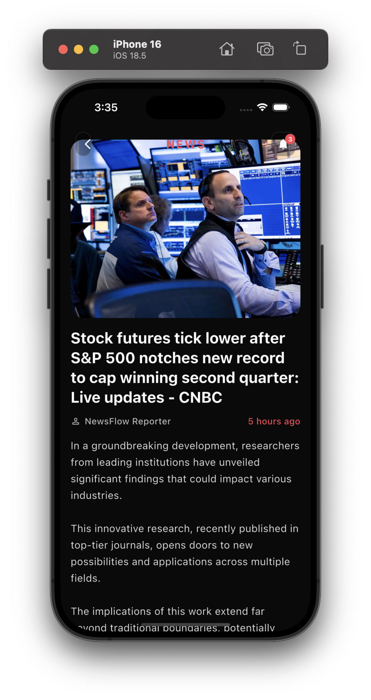
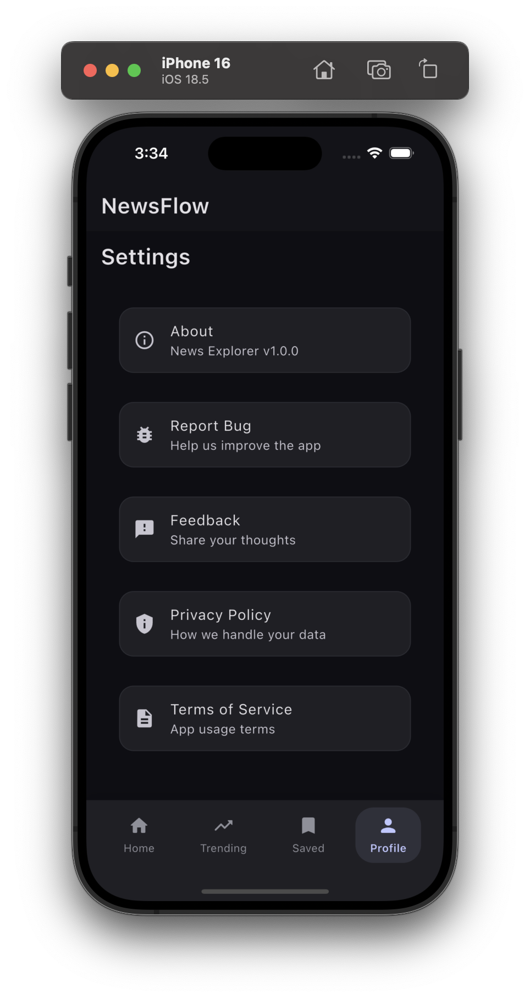

# 📰 NewsFlow - Flutter News App

<div align="center">


A Flutter app for reading the latest news from multiple sources, with category filtering and light/dark themes.

</div>

## 📱 Screenshots

<div align="center">

🟦 **Home Screen**


📰 **Content Screen**



⚙️ **Settings Screen**



</div>

---

## ✨ Features
- 🌐 News from multiple APIs
- 🕒 Real-time data fetching (latest headlines on every refresh)
- 🔄 Pull to refresh
- 🗂️ Browse by categories
- ⭐ Save to favorites
- 🌙 Light & dark theme

---

## 🔌 APIs Used
- 🏆 NewsAPI.org
- 📰 GNews
- 💡 Bing News
- 🌍 MediaStack
- 📡 NewsData.io

---

## 🛠️ Problems Faced
- 🔑 **API Key Limits:** Free APIs have strict rate limits. I implemented fallback logic and key rotation to keep news flowing.
- 🖼️ **Image Consistency:** Some articles lack images. I filter out such articles and use fallback images to maintain a clean UI.
- 🗂️ **Category Mapping:** Each API uses different category names. I mapped and unified categories for a seamless user experience.
- 🔄 **Refreshing Data:** To avoid cached or repeated results, I added cache-busting and randomization to API requests.

---

## 📁 File Structure
```
lib/
  📄 main.dart           # App entry point
  📁 models/             # Data models (e.g. news, category)
  📁 services/           # API integration and data fetching
  📁 screens/            # UI screens (home, content, settings, etc.)
  📁 widgets/            # Reusable UI components
```

---

<div align="center">

Made with ❤️ by Shourya

</div> 